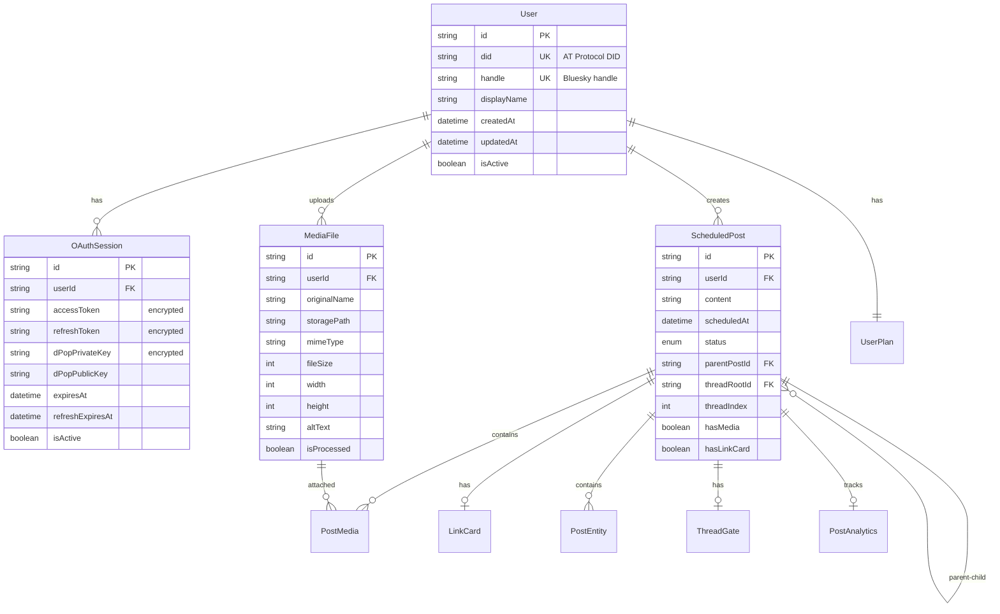

# データ構造設計

このドキュメントでは、Chronopostのデータ構造設計について、段階的な実装方針と将来的な拡張計画を説明します。

## 設計方針

### 段階的実装アプローチ

1. **Phase 1**: シンプルなテキスト投稿の予約機能
2. **Phase 2**: スレッド形式投稿・基本的なリッチテキスト対応
3. **Phase 3**: 画像添付・リンクカード・メンション・ハッシュタグ
4. **Phase 4**: 動画投稿・スレッドゲート・高度な機能

### 技術制約

- BlueskyのAT Protocol準拠
- OAuth + DPoP認証必須
- PostgreSQL + Prisma ORM
- 段階的な機能追加に対応できる拡張可能な設計

## Phase 1: 基本実装

### 要件

- ユーザーは1つまたは複数のOAuthセッションを持つ
- ユーザーは複数のテキスト投稿を予約できる
- システムは指定時刻に投稿を自動実行する
- 投稿実行後は予約データを削除する
- 繰り返し投稿はサポートしない

### データモデル (Phase 1)

```prisma
// ユーザー管理
model User {
  id          String   @id @default(cuid())
  did         String   @unique        // AT Protocol DID
  handle      String   @unique        // Bluesky handle (@user.bsky.social)
  displayName String?                 // 表示名
  createdAt   DateTime @default(now())
  updatedAt   DateTime @updatedAt
  isActive    Boolean  @default(true)

  // リレーション
  sessions    OAuthSession[]
  posts       ScheduledPost[]

  @@map("users")
}

// OAuth セッション管理
model OAuthSession {
  id               String   @id @default(cuid())
  userId           String
  accessToken      String   @db.Text    // 暗号化保存
  refreshToken     String   @db.Text    // 暗号化保存
  dPopPrivateKey   String   @db.Text    // 暗号化保存
  dPopPublicKey    String   @db.Text
  expiresAt        DateTime
  refreshExpiresAt DateTime
  createdAt        DateTime @default(now())
  updatedAt        DateTime @updatedAt
  isActive         Boolean  @default(true)

  // メタデータ
  userAgent        String?
  ipAddress        String?
  lastUsedAt       DateTime @default(now())

  // リレーション
  user             User     @relation(fields: [userId], references: [id], onDelete: Cascade)

  @@index([userId, isActive])
  @@index([expiresAt])
  @@map("oauth_sessions")
}

// 予約投稿 (Phase 1: シンプルなテキスト投稿)
model ScheduledPost {
  id          String     @id @default(cuid())
  userId      String
  content     String     @db.Text      // 投稿内容
  scheduledAt DateTime                 // 予約投稿時刻
  status      PostStatus @default(PENDING)
  createdAt   DateTime   @default(now())
  updatedAt   DateTime   @updatedAt
  executedAt  DateTime?                // 実行完了時刻
  errorMsg    String?                  // エラーメッセージ
  retryCount  Int        @default(0)   // リトライ回数

  // AT Protocol関連
  blueskyUri  String?                  // 投稿後のat://URI
  blueskyRkey String?                  // レコードキー

  // リレーション
  user        User       @relation(fields: [userId], references: [id], onDelete: Cascade)

  @@index([scheduledAt, status])
  @@index([userId, status])
  @@index([status, createdAt])
  @@map("scheduled_posts")
}

// 投稿ステータス
enum PostStatus {
  PENDING     // 実行待ち
  EXECUTING   // 実行中
  COMPLETED   // 完了
  FAILED      // 失敗
  CANCELLED   // キャンセル
}
```

## Phase 2: スレッド投稿対応

### 追加要件

- 投稿のスレッド形式（親子関係）対応
- リプライチェーンの実行順序保証
- スレッド全体の実行状態管理

### データモデル拡張 (Phase 2)

```prisma
model ScheduledPost {
  // Phase 1 のフィールド + 以下を追加

  // スレッド関連
  parentPostId     String?              // 親投稿ID（リプライの場合）
  threadRootId     String?              // スレッドのルート投稿ID
  threadIndex      Int        @default(0) // スレッド内の順序
  isThreadRoot     Boolean    @default(true)

  // 実行制御
  dependsOnPostId  String?              // 実行依存関係
  canExecute       Boolean    @default(true)

  // リレーション
  parent           ScheduledPost? @relation("PostThread", fields: [parentPostId], references: [id])
  children         ScheduledPost[] @relation("PostThread")
  threadRoot       ScheduledPost? @relation("ThreadRoot", fields: [threadRootId], references: [id])
  threadPosts      ScheduledPost[] @relation("ThreadRoot")
  dependsOn        ScheduledPost? @relation("PostDependency", fields: [dependsOnPostId], references: [id])
  dependentPosts   ScheduledPost[] @relation("PostDependency")

  @@index([threadRootId, threadIndex])
  @@index([parentPostId])
}
```

## Phase 3: リッチコンテンツ対応

### 追加要件

- 画像・動画の添付
- URLリンクカードのプレビュー
- ハッシュタグ・@メンションの解析
- ファイルアップロード管理

### データモデル拡張 (Phase 3)

```prisma
// メディアファイル管理
model MediaFile {
  id            String     @id @default(cuid())
  userId        String
  originalName  String                  // 元のファイル名
  storagePath   String                  // ストレージパス
  mimeType      String                  // MIME タイプ
  fileSize      Int                     // ファイルサイズ（bytes）
  width         Int?                    // 画像・動画の幅
  height        Int?                    // 画像・動画の高さ
  duration      Int?                    // 動画の長さ（秒）
  altText       String?                 // 代替テキスト
  isProcessed   Boolean    @default(false) // 処理完了フラグ
  createdAt     DateTime   @default(now())
  updatedAt     DateTime   @updatedAt

  // AT Protocol Blob関連
  blobRef       String?                 // Bluesky Blob参照
  blobSize      Int?                    // Blob サイズ

  // リレーション
  user          User       @relation(fields: [userId], references: [id], onDelete: Cascade)
  postMedia     PostMedia[]

  @@index([userId, createdAt])
  @@index([isProcessed])
  @@map("media_files")
}

// 投稿-メディアの関連
model PostMedia {
  id           String        @id @default(cuid())
  postId       String
  mediaFileId  String
  mediaIndex   Int           @default(0) // 表示順序
  createdAt    DateTime      @default(now())

  // リレーション
  post         ScheduledPost @relation(fields: [postId], references: [id], onDelete: Cascade)
  mediaFile    MediaFile     @relation(fields: [mediaFileId], references: [id], onDelete: Cascade)

  @@unique([postId, mediaFileId])
  @@index([postId, mediaIndex])
  @@map("post_media")
}

// リンクカード情報
model LinkCard {
  id          String        @id @default(cuid())
  postId      String
  url         String        @db.Text    // 元URL
  title       String?                   // ページタイトル
  description String?       @db.Text    // ページ説明
  imageUrl    String?                   // OG画像URL
  siteName    String?                   // サイト名
  createdAt   DateTime      @default(now())
  updatedAt   DateTime      @updatedAt

  // リレーション
  post        ScheduledPost @relation(fields: [postId], references: [id], onDelete: Cascade)

  @@unique([postId])
  @@map("link_cards")
}

// メンション・ハッシュタグ管理
model PostEntity {
  id        String        @id @default(cuid())
  postId    String
  type      EntityType    // MENTION, HASHTAG, URL
  text      String                      // 表示テキスト
  startPos  Int                         // 開始位置
  endPos    Int                         // 終了位置
  value     String?                     // 実際の値（DID, URL等）
  createdAt DateTime      @default(now())

  // リレーション
  post      ScheduledPost @relation(fields: [postId], references: [id], onDelete: Cascade)

  @@index([postId, type])
  @@map("post_entities")
}

enum EntityType {
  MENTION   // @username
  HASHTAG   // #tag
  URL       // https://...
}

// ScheduledPost にフィールド追加
model ScheduledPost {
  // 既存フィールド + 以下を追加

  // リッチコンテンツ
  hasMedia      Boolean @default(false)   // メディア添付有無
  hasLinkCard   Boolean @default(false)   // リンクカード有無
  langs         String[]                  // 言語設定

  // リレーション
  media         PostMedia[]
  linkCard      LinkCard?
  entities      PostEntity[]
}
```

## Phase 4: 高度な機能

### 追加要件

- 動画投稿（有料オプション）
- スレッドゲート（返信制限）
- 投稿分析・統計
- 一括投稿管理

### データモデル拡張 (Phase 4)

```prisma
// スレッドゲート設定
model ThreadGate {
  id                String        @id @default(cuid())
  postId           String
  allowMentioned   Boolean       @default(true)  // メンションされたユーザー
  allowFollowing   Boolean       @default(true)  // フォロー中ユーザー
  allowListMembers String[]                      // 特定リストのメンバー
  createdAt        DateTime      @default(now())

  // リレーション
  post             ScheduledPost @relation(fields: [postId], references: [id], onDelete: Cascade)

  @@unique([postId])
  @@map("thread_gates")
}

// 投稿分析データ
model PostAnalytics {
  id           String        @id @default(cuid())
  postId       String
  likes        Int           @default(0)
  reposts      Int           @default(0)
  replies      Int           @default(0)
  impressions  Int           @default(0)
  lastUpdated  DateTime      @default(now())

  // リレーション
  post         ScheduledPost @relation(fields: [postId], references: [id], onDelete: Cascade)

  @@unique([postId])
  @@map("post_analytics")
}

// ユーザープラン管理
model UserPlan {
  id               String    @id @default(cuid())
  userId           String
  planType         PlanType  @default(FREE)
  mediaUploadQuota Int       @default(100)     // MB/月
  videoEnabled     Boolean   @default(false)
  maxPostsPerMonth Int       @default(1000)
  validUntil       DateTime?
  createdAt        DateTime  @default(now())
  updatedAt        DateTime  @updatedAt

  // リレーション
  user             User      @relation(fields: [userId], references: [id], onDelete: Cascade)

  @@unique([userId])
  @@map("user_plans")
}

enum PlanType {
  FREE
  BASIC
  PREMIUM
}
```

## ER図



## 実装優先度

### Phase 1 (MVP): 2-3週間

- [ ] User, OAuthSession, ScheduledPost (基本)
- [ ] テキスト投稿のみ
- [ ] 基本的なスケジューラー

### Phase 2: 2-3週間

- [ ] スレッド投稿対応
- [ ] 親子関係の実行制御
- [ ] エラーハンドリング強化

### Phase 3: 3-4週間

- [ ] MediaFile, PostMedia, LinkCard
- [ ] 画像アップロード
- [ ] OGPプレビュー
- [ ] メンション・ハッシュタグ解析

### Phase 4: 4-6週間

- [ ] 動画対応（有料オプション）
- [ ] ThreadGate
- [ ] 分析機能
- [ ] プラン管理

## セキュリティ考慮事項

### データ保護

- 全てのOAuthトークンは暗号化保存
- メディアファイルのアクセス制御
- PII（個人識別情報）の適切な管理

### リソース制限

- ファイルサイズ制限
- アップロード頻度制限
- プラン別機能制限

### AT Protocol準拠

- Blob ストレージの適切な利用
- Record 形式の準拠
- DID の検証

この設計により、シンプルな開始から高機能なサービスまで段階的に発展させることができます。
