# ワークフロー設計

このドキュメントでは、Chronopostの主要な処理フローを詳細に説明します。OAuth認証、予約投稿作成、自動実行の各プロセスを可視化しています。

## 1. OAuth認証フロー

### 要件
- AT Protocol OAuth 2.0 + DPoP認証
- PKCE（Proof Key for Code Exchange）必須
- コンフィデンシャルクライアント実装
- セッション管理とトークンローテーション

### シーケンス図

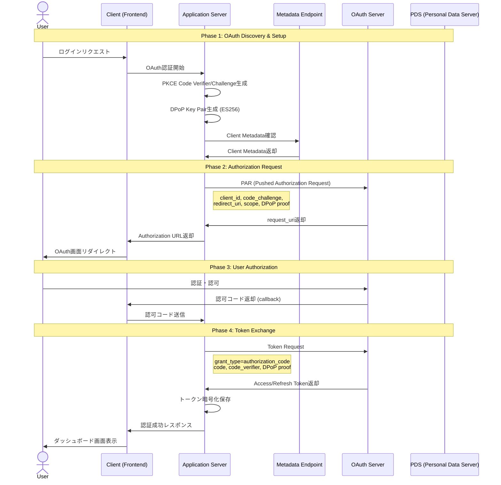

### DPoP実装詳細フロー

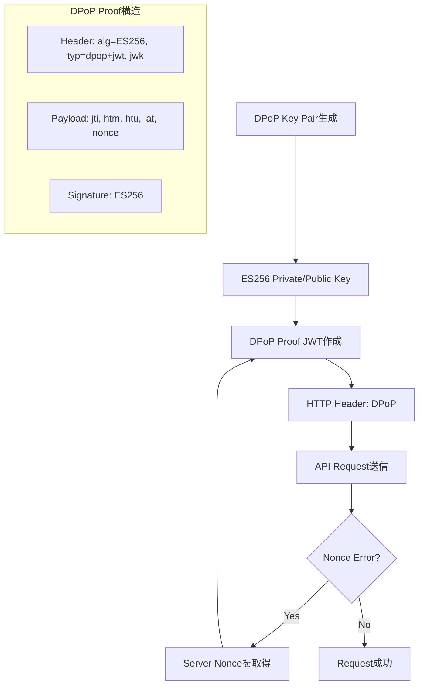

## 2. 予約投稿作成フロー

### Phase 1: シンプルテキスト投稿

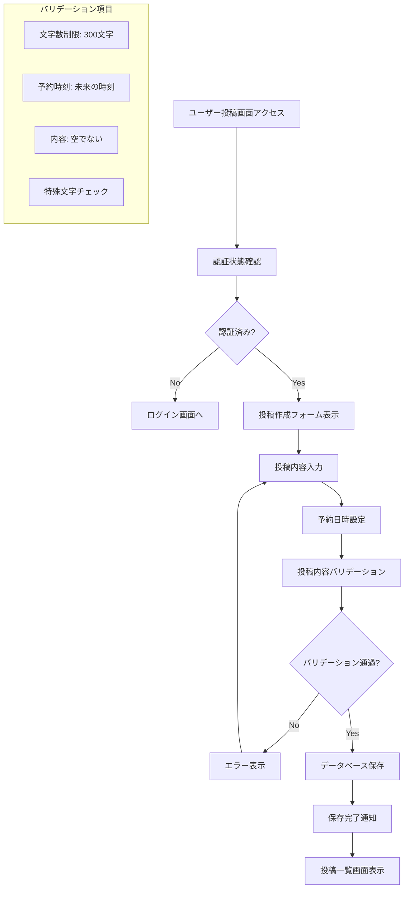

### Phase 2: スレッド投稿対応

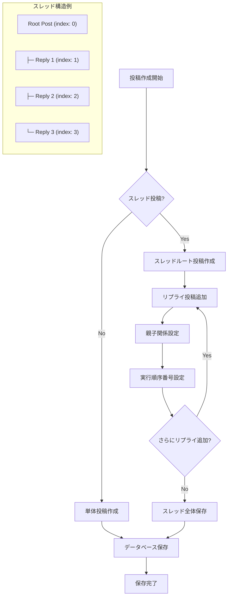

### Phase 3: リッチコンテンツ対応

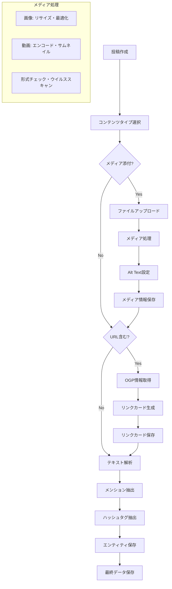

## 3. 投稿自動実行フロー

### メインスケジューラー処理

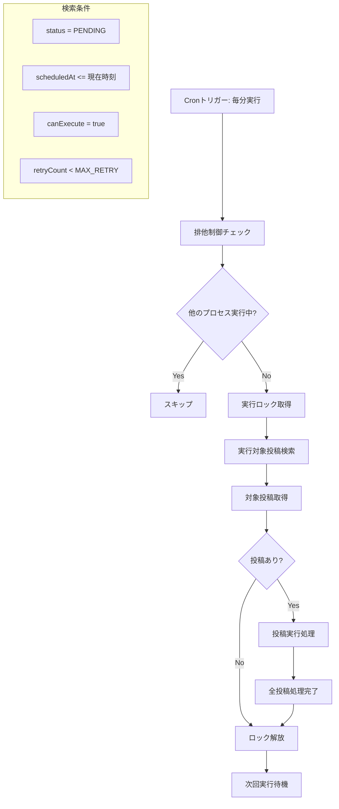

### 個別投稿実行フロー

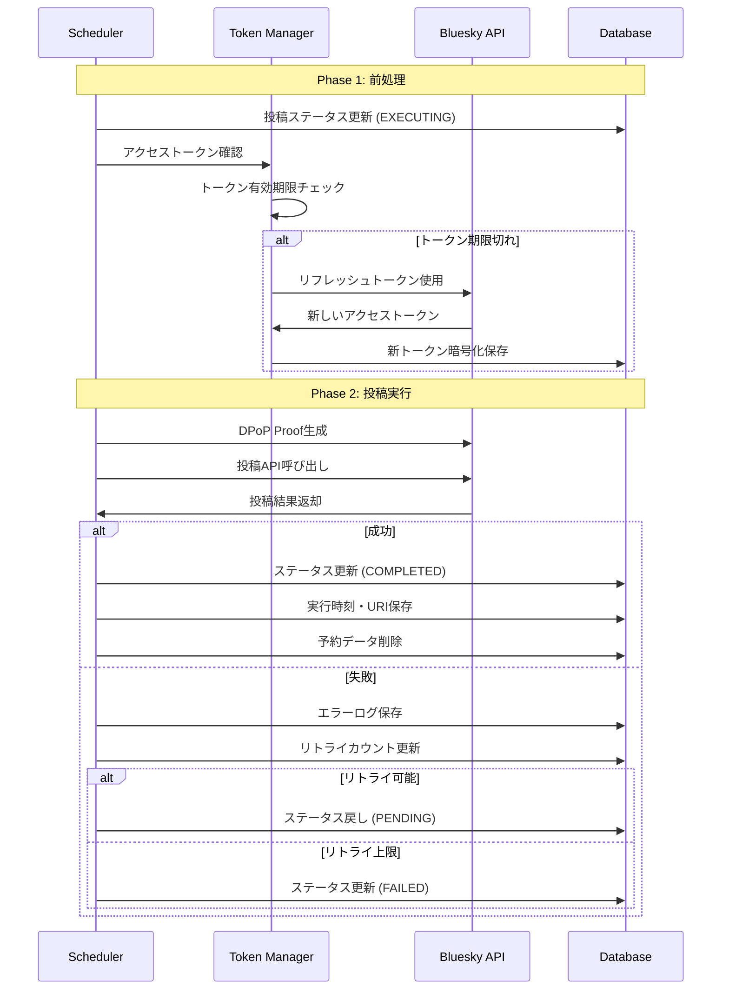

### スレッド投稿実行フロー

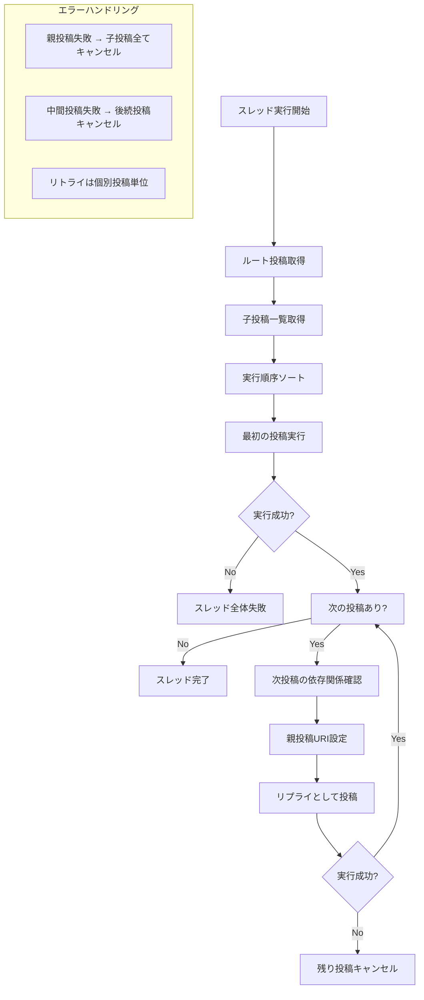

## 4. トークン管理フロー

### 自動リフレッシュ機構

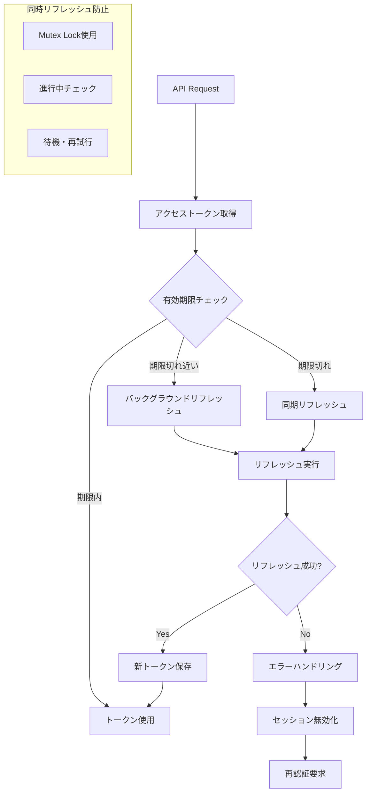

### セッション管理フロー

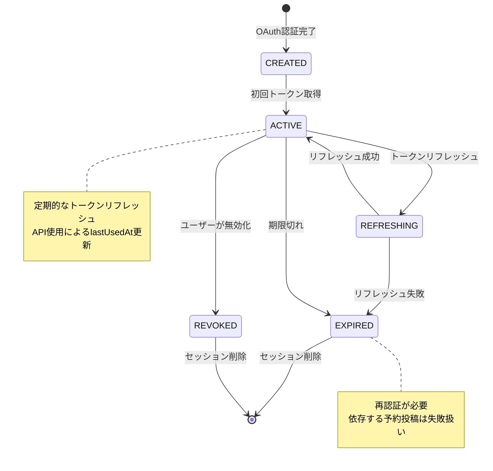

## 5. エラーハンドリングフロー

### 段階的エラー対応

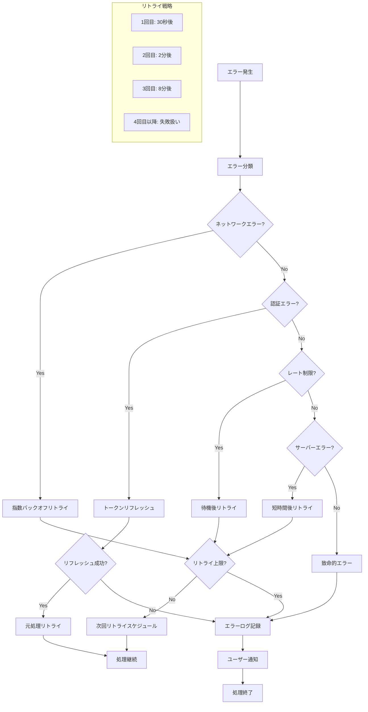

## 6. メディア処理フロー (Phase 3)

### 画像アップロードフロー

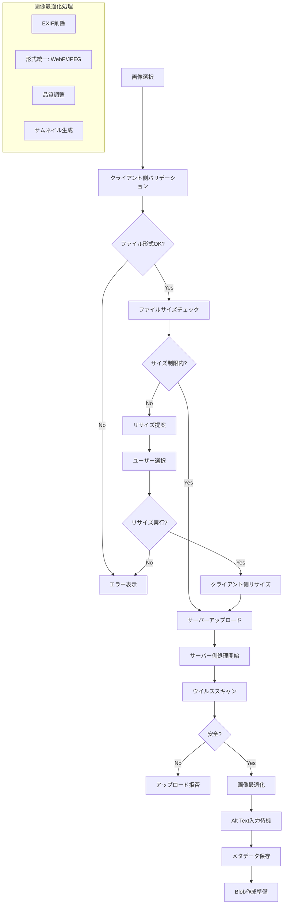

### 動画処理フロー (Phase 4)

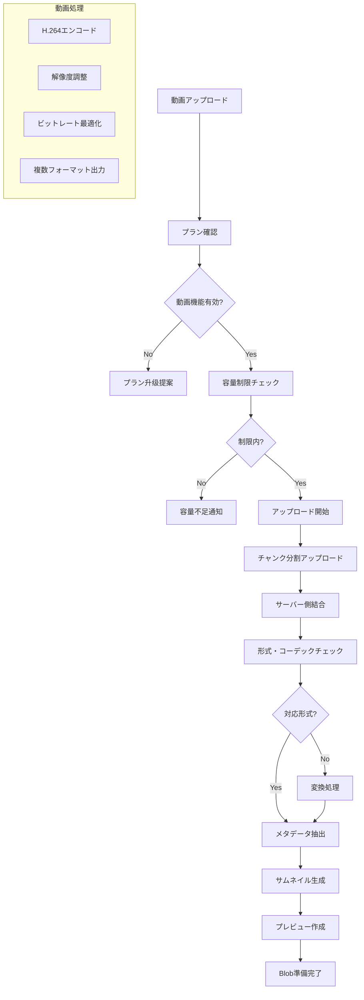

## 7. 監視・ログフロー

### システム監視フロー

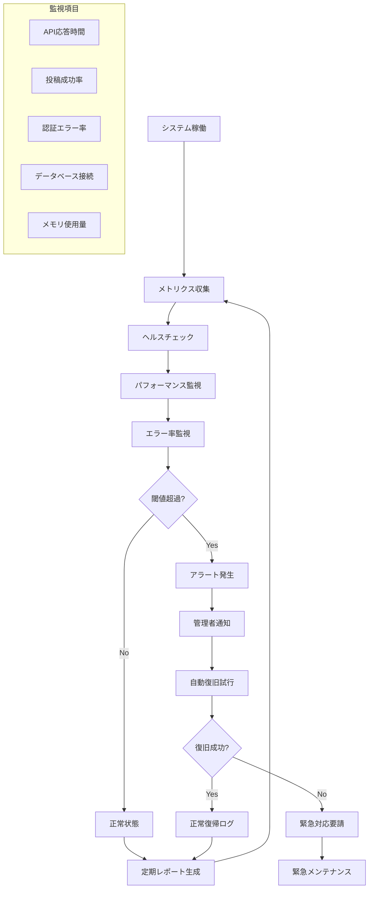

### ログ管理フロー

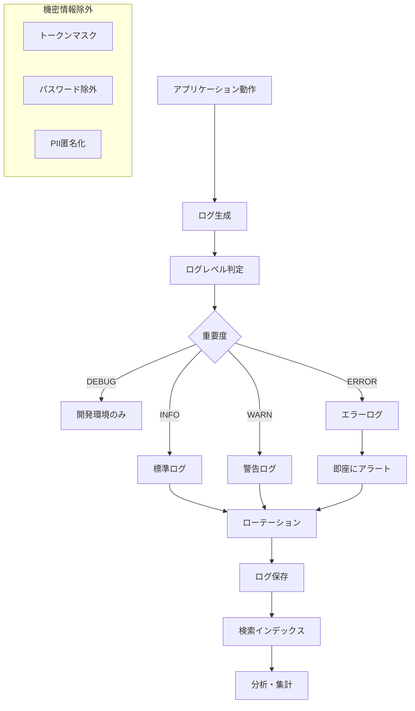

## 8. データベース管理フロー

### マイグレーション管理

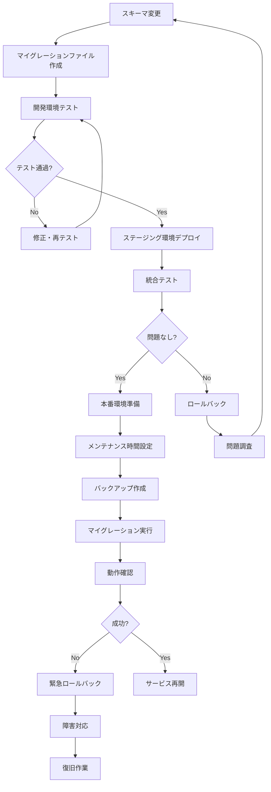

### データクリーンアップフロー

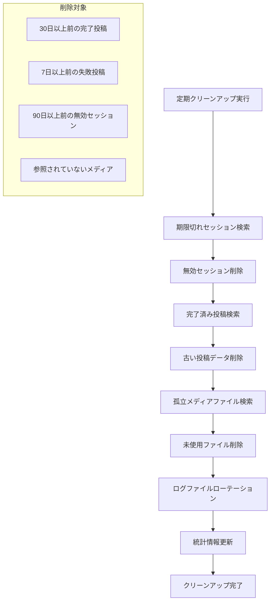

## 9. デプロイメントフロー

### CI/CDパイプライン

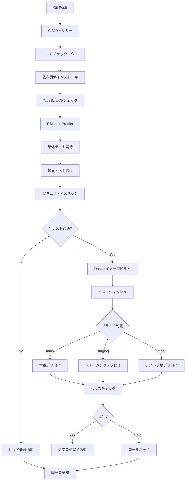

## 10. セキュリティフロー

### セキュリティ監視

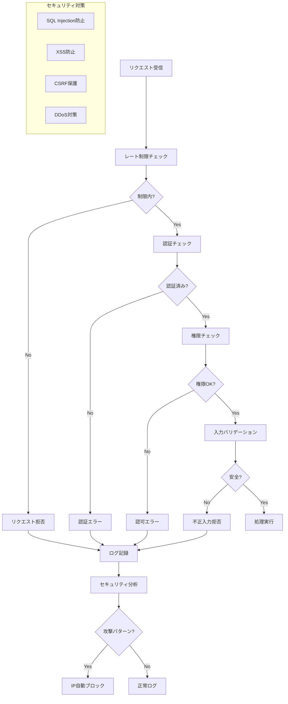

このワークフロー設計により、OAuth認証からメディア処理、システム監視まで、包括的な処理フローが可視化されました。各フェーズの実装時には、対応するフローを参考に詳細な実装を進めることができます。